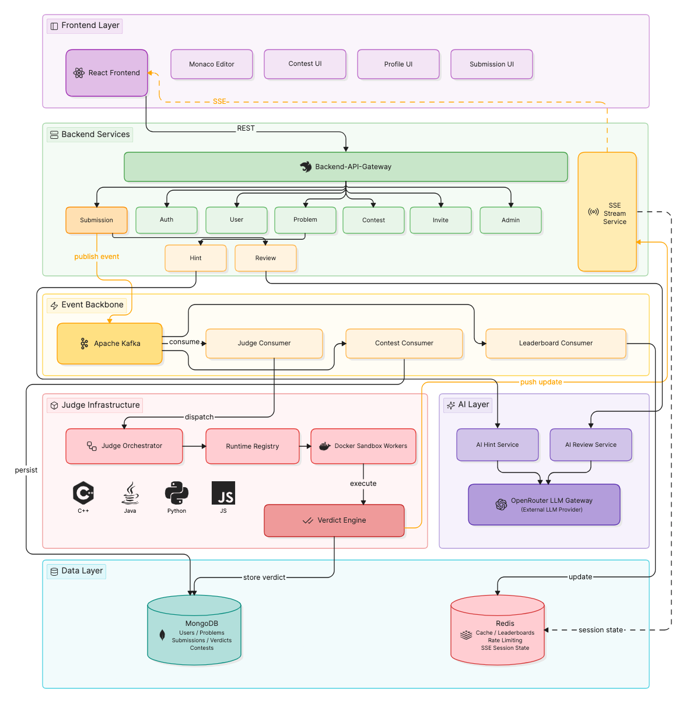

# Judge Sphere 🚀

An enterprise-grade, full-stack competitive programming platform featuring asynchronous code execution sandboxes, AI-native debugging feedback, real-time verdict streaming, and distributed contest management.

---

## 🛠️ Technology Stack

| Layer | Technology | Purpose |
| :--- | :--- | :--- |
| **Frontend Framework** | React.js + Redux + Tailwind + TypeScript | Type-safe, scalable globally-managed state UI. |
| **Backend Framework** | Express.js + TypeScript | Structural, decoupled middleware-driven REST API layer. |
| **Browser Editor** | Monaco Editor | VS Code-equivalent browser editing workspace. |
| **Async/Event Backbone** | Apache Kafka | Resilient, distributed asynchronous submission worker queuing. |
| **Live Verdict Updates** | Server-Sent Events (SSE) | Low-latency client notifications and live compilation verdicts. |
| **Code Execution Isolation** | Docker Sandbox Workers | Secure, resource-capped runtime boundary for untrusted code execution. |
| **Persistence** | MongoDB + Redis | Dynamic storage engine paired with caching matrices. |

---

## 🏗️ High-Level Architecture

The platform scales linearly by segregating incoming HTTP requests from the intensive execution layer using a distributed message broker backbone.

### Core Operational Workflow
1. **Request Lifecycle:** Client submissions land on the Backend API Gateway and pass through to target services.
2. **Asynchronous Queuing:** The platform converts execution requests into events distributed through **Apache Kafka** partitioned clusters to the Judge Consumer.
3. **Isolated Execution Engine:** Decoupled workers pick up jobs, spin up resource-constrained ephemeral **Docker Sandbox Workers** (supporting C++, Java, Python, and JS), validate output vectors via the Verdict Engine, and persist state blocks in **MongoDB**.
4. **Reactive Live-Streaming:** The **SSE Stream Service** captures structural verdict mutations on Redis sub-channels, pushing real-time tracking streams instantly back down to the React Frontend.
5. **AI Evaluation Loop:** Non-blocking processing routines trigger LLM calls via an **OpenRouter LLM Gateway** to map custom prompts and formulate code-review report evaluations or multi-tier logical hints.

---

## 🔮 Platform Features

* **Advanced Monaco Code Workspace:** Full autocomplete contexts, language switchers, and input parameters paired with problem statements and sample test cases.
* **Asynchronous Verdict Lifecycles:** Secure background execution preventing blocking network connections while delivering transparent runtime summaries and metric footprints.
* **AI-Native Engineering Support:** Contextual code-review rubrics evaluating readability, efficiency, and implementation quality alongside semantic tips derived entirely from submission failures.
* **Scalable Contests & Leaderboards:** Synchronized distributed public global contests and invite-link-friendly timed matches featuring participant state management.
* **Role-Based Governance (RBAC):** Hierarchical administrative controls managing platform audits, problem compilation schemas, and content moderation interfaces.

---

## 🗂️ Core Services Map

| Service | Responsibility |
| :--- | :--- |
| **Auth Service** | Registration, login, JWT issuance, access checks. |
| **User Service** | Profile, preferences, activity, ratings. |
| **Problem Service** | Problem metadata, statements, tags, difficulty, samples. |
| **Submission Service** | Submission creation, lifecycle persistence, result lookup. |
| **Judge Worker** | Compile/run pipeline inside isolated Docker environments. |
| **Event Publisher** | Publishes submission and contest events to Kafka. |
| **Kafka Consumers** | Process submission, leaderboard, AI, and notification events. |
| **Hint Service** | AI hint generation with guardrails. |
| **Review Service** | AI code review and scoring. |
| **Contest Service** | Friendly contests, global contests, timing, participant state. |
| **Invite Service** | Secure share-link token lifecycle. |
| **Collaboration Service** | Pair room creation, presence, shared editor session. |
| **File Service** | Upload validation, language extractor, code extractor. |
| **Admin Service** | Problem/contest moderation, audit visibility. |
| **SSE Stream Service** | Server-to-client event streams for verdicts, job progress, notifications. |

---

## 🔀 Application Route Matrix

| Domain Interface | Application Endpoint | Target Operational Responsibility |
| :--- | :--- | :--- |
| **Landing Base** | `/` | Product overview and entry point. |
| **Sign Up** | `/user/signup` | User registration interface. |
| **Log In** | `/user/login` | Authentication handling interface. |
| **SaaS Dashboard** | `/dashboard` | Personalized overview metrics and progression analytics. |
| **Problems List** | `/problems` | Browse and search available problems index. |
| **Problem Details** | `/problems/:id` | Statement analysis, parameters, and sample test cases. |
| **Solve Page** | `/problems/:id/solve` | Monaco editor integration, running, debugging, and submitting. |
| **Hint View** | `/problems/:id/hints` | Contextual AI hint displays. |
| **Submission History** | `/submissions` | Historic logs of user attempts and runtime verdicts. |
| **Submission Detail** | `/submissions/:id` | Logs, evaluation metrics, and runtime result details. |
| **Review Report** | `/submissions/:id/review` | Structural AI code review metrics and scoring output reports. |
| **Friendly Contests** | `/contests/friendly` | Private contest listings and management workspaces. |
| **Invite Join Page** | `/invite/:token` | Join private arenas from tokenized shared links. |
| **Global Contests** | `/contests/global` | Open, timed matching tournaments. |
| **Live Contest Room** | `/contests/:id/live` | Contest workspace environment panels. |
| **Profile** | `/user/:username` | Public profile telemetry, activity metrics, and public user rankings. |
| **Leaderboard Node** | `/leaderboard` | Global and tournament-level live user rankings. |
| **Admin Dashboard** | `/admin` | Infrastructure administration overview, governance, and audit flags. |

---

## 🗺️ Incremental Development Roadmap

The construction matrix relies on a sequence of 14 key development steps:

| Step | Focus Area | Key Deliverables |
| :--- | :--- | :--- |
| **1** | Foundation & Repo Setup | Turbo monorepo setup, config module, error middleware, logger. |
| **2** | Authentication | User model, auth routes, JWT access/refresh tokens, password hashing, role guard middleware. |
| **3** | User & Profile | Profile retrieval, preferences, activity summaries, public profile page. |
| **4** | Problem Service & Authoring | Problem CRUD, browse/search API, statement rendering, tag & difficulty indexing. |
| **5** | Monaco Solve Page | Editor integration, language switcher, run panel, output console, submit & hint UI. |
| **6** | Submission Service | POST /submissions, submission schema, Kafka producer, async status lifecycle. |
| **7** | Judge Worker & Sandbox | Kafka consumer, Docker sandbox wrapper, runtime registry, resource limit enforcement. |
| **8** | SSE Verdict Streaming | GET /streams/submissions/:id, connection management, event serialisation, reconnect. |
| **9** | File Upload Execution | Upload validation, language/code extractors, Kafka-backed execution, scoped formats. |
| **10** | Contest Implementation | Friendly/global contests, invite token flow, contest room APIs, score calculation events. |
| **11** | Leaderboard Streaming | Contest score events, Redis leaderboard cache, SSE stream endpoint for updates. |
| **12** | AI Hints & Code Review | POST /ai/hints & /ai/review, prompt templates, guardrails, rubric scoring, review history. |
| **13** | Debug Support | Custom input execution, runtime error summaries, full debugger. |
| **14** | Admin & Moderation | RBAC, problem/contest moderation, user restrictions, audit logs. |